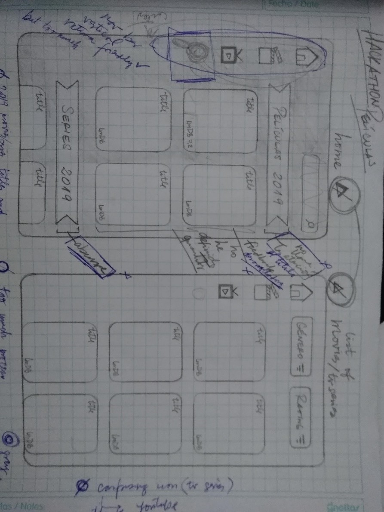
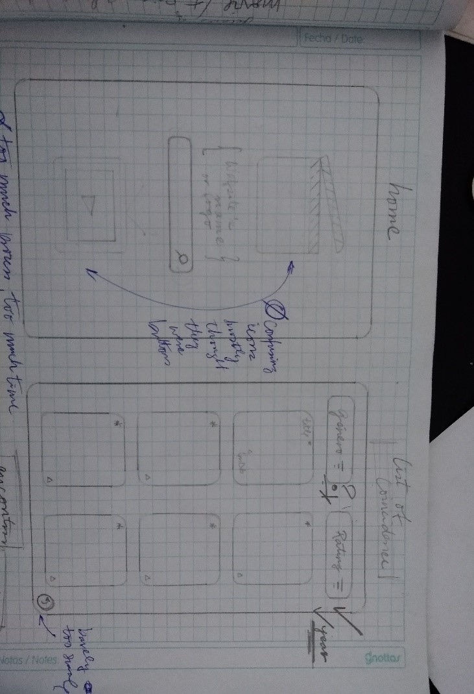
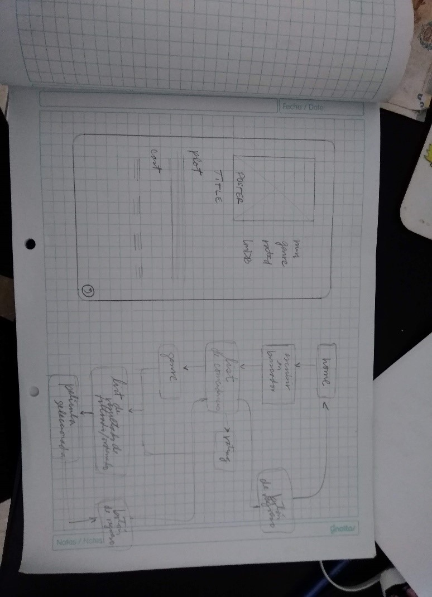

# "Hackathon" de final de _Common Core_, películas : Movies & Series HandBook, 

## Índice

* [Resumen ](#Resumen)
* [Investigación ](#Investigación)
* [Historias de Usuario ](#Historias-de-Usuario)

* [Planning](#planning)

El proceso se realizó en cuatro etapas: investigación, definición-ideación, prototipado y testeos de usuarios.

***

## Resumen

Movies $ Series HandBook es una aplicación web que permite descubrir información acerca de títulos, géneros, ratings de películas y series, antiguas y actuales, tan sólo con ingresar parte de su título. Utiliza OMDb, una web API que permite obtener información de las búsquedas a través de títulos, palabras claves o incluso por id de imdb.

## Investigación

Se realizó mediante una entrevista a usuarios en edades comprendidas entre 15 y 50 años, en las cuales se determinaron las necesidades e intereses de los mismos.

## Historias de Usuario

### Historia 1
Yo como usuario deseo poder buscar una película o serie con solo colocar una palabra

**FUNCIONALIDAD:**
Crear una función que busque las coincidencias de una o varias palabras asociadas a un titulo de película

**DOM:**
- Crear una función que muestre en html las coincidencias de la busqueda, integrando las clases de bootstrap
- Crear un formulario para ingresar la búsqueda
- Crear un contenedor para mostrar los resultados

**Definición de Terminado:**
El usuario escribe su búsqueda y al hacer click al botón de buscar, aparece un listado de coincidencias, en
forma de grid, con los estilos css acordados.La historia de usuario ha sido testeada con usuarios.

### Historia 2
Yo como usuario quiero poder ordenar la lista de películas y/o series por rating

**FUNCIONALIDAD:**
- Crear una función que ordene las películas por rating

**DOM:**
- Crear botón de ordenado
- Crear una función que muestre en html los resultados del ordenado integrando las clases establecidas por
    bootstrap

**Definición de Terminado:**

El usuario hace click al botón de ordenar y se acomoda el listado de coincidencias, en orden descendente
del rating, manteniendo los estilos css acordados.La historia de usuario ha sido testeada con usuarios.

### Historia 3
Yo como usuario deseo ver la información de la película o serie seleccionada

**FUNCIONALIDAD:**
Crear una función que busque la información de una película en función de su id
**DOM:**
Crear una función que imprima en html la información de la película seleccionada, integrando las clases de
bootstrap

**Definición de Terminado:**

El usuario hace click sobre la imagen de la película y aparece la vista del detalle, con la información acordada (título, duración, género, actores, sinopsis, rating), manteniendo los estilos css acordados.

La historia de usuario ha sido testeada con usuarios.

Posteriormente, se realizó el prototipado de baja fidelidad, el cual fue testeado con usuarios, de las edades antes mencionadas.Y finalmente el prototipo de alta fidelidad.

## PROTOTIPO DE BAJA FIDELIDAD

### Testeos de usabilidad 
* El proceso para llegar a la película deseada con sus respectivos detalles era muy largo.
* Apenas ingresa, el enfoque principal del usuario se encuentra en el ícono de búsqueda (lupita).
* Se prefiere colores oscuros porque resalta los colores de los posters. Además, demuestra una cierta conexión del cine o, encaso de “sleepovers”,         “Marathon nights”.
* A pesar de ser llamativo, el NavBar vertical hacía sentir al usuario que sus acciones son limitadas.
* En la ventana “HOME”, ni el título y el contenido llamaba la atención a la gran mayoría de usuarios.
* Los usuario apreciaron la falta de “sign up forms” en el app.  

### Testeos de usabilidad 
* El background le hacía pensar al usuario que eran opciones para seleccionar.
* El botón de regreso no fue ni hallado, ni reconocido como tal.
* Tambíen, el proceso total del app se consideró extenso por el usuario.
* Las opciones de filtro fueron entendibles, pero la gran mayoría le daba mayor importancia a la opción de ordenado por rating.

## PROTOTIPO DE ALTA FIDELIDAD 

![Imagen 1][1]  ![Imagen 2][2]

 [1]: src/assets/prot_af_1.png
 [2]: src/assets/prot_af_2.png

### Testeos de usabilidad
* Al usuario le agradó el diseño minimalista de la página.
* El usuario relacionó el estilo de la app con el de un cómic.
* El logo se dio a entender que habría variedad entre películas y Tv Series
* El tono background donde se contenía la lista de coincidencias le quitó el misterio que ocasionó el home. 
* El usuario relacionaba las estrellas con el rating de las películas/Tv Series, pero no detectó su función de ordenamiento hasta después de su uso.

![Imagen 3][3]  ![Imagen 4][4]

 [3]: src/assets/prot_af_3.png
 [4]: src/assets/prot_af_4.png

* La typografía y tonos de colores fue “retina friendly” para el usuario hasta que se llegó a la parte dónde se muestran los personajes.
* Se apreció la información detallada a lo primordial por el usuario

https://www.figma.com/proto/W263NumHRDhWaXaNiTctL6jr/HACK_Peli?node-id=1%3A2&scaling=scale-down&redirected=1

## Plannig

1. Definición del producto                          
2. Entrevistas a usuarios                           
3. Definición de Historias de usuarios              
4. Diseño del Prototipo de baja fidelidad           
5. Flujo de usuarios                                 
6. Diseño del Prototipo de alta fidelidad en Figma  
7. Testeos de Usabilidad                            
8. Implementacion de interfaz de usuario            
   - Creación del ambiente de desarrollo             
   - Creación de la logica y componentes             
   - Maquetación de la interfaz  en HTML             
   - Personalización de los estilos CSS con Boostrap 

